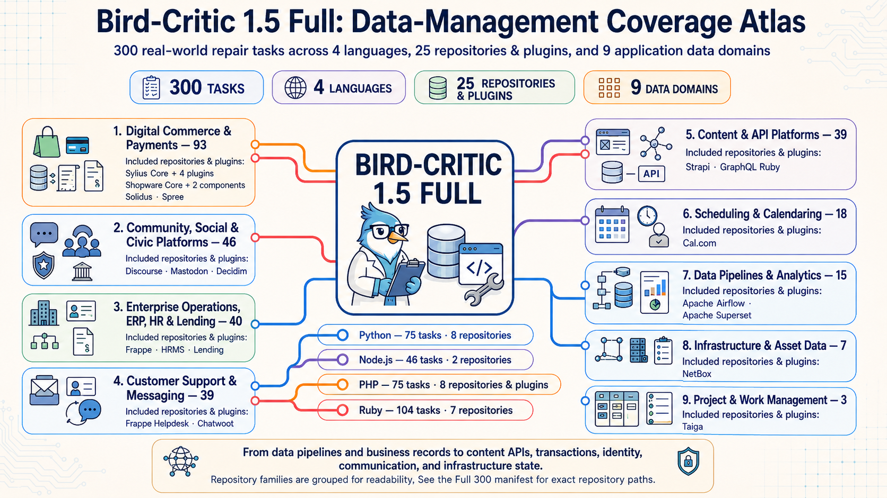

# Bird-Critic 1.5: An Executable Benchmark for Repairing Database-Backed Applications

## Dataset Construction, Multi-Ecosystem Coverage, and Preliminary Agent Evaluation

**Technical Report Draft v0.1 · August 2026**  

**Authors:** Yongfeng Huang<sup>1,\*,†</sup>, Xiaolong Li<sup>2,\*</sup>, Zixi Xu<sup>2</sup>, Ziyue Luo<sup>2</sup>, Yue Wu<sup>2</sup>, Binshang Chen<sup>2</sup>, Heng Chang<sup>3</sup>, JinYang Li<sup>2,†</sup>, James Cheng<sup>1</sup>

<sup>1</sup> The Chinese University of Hong Kong (CUHK)  
<sup>2</sup> The University of Hong Kong (HKU)  
<sup>3</sup> Tsinghua University

<sup>\*</sup> Equal contribution. Author order reflects the listed order.  
<sup>†</sup> Project leads.  

**Status:** Living technical report; not peer reviewed

<!--
Release checklist before publication:
1. Insert the canonical Hugging Face dataset URLs.
2. Add the dataset license and third-party source/license notices.
3. Publish the exact pinned OpenHands, model-provider, budget, and concurrency configuration.
4. Replace the draft version and date.
-->

## Abstract

Bird-Critic 1.5 is an executable software-repair benchmark constructed from historical pull requests in database-backed application repositories. Its purpose is to evaluate whether a coding agent can understand a repository-level issue, modify the relevant code, and satisfy task-specific executable verification in a reproducible environment.

The benchmark currently provides two fixed editions: **Lite 100**, containing 100 tasks from 11 repositories, and **Full 300**, containing the Lite set plus 200 additional tasks from a total of 25 repositories. Both editions cover four language ecosystems: Python, Node.js (JavaScript/TypeScript), Ruby, and PHP. Tasks are distributed in Harbor-compatible form and include an issue description, a containerized environment, a task-specific verifier, and an oracle patch. Oracle and no-operation controls are used to check the benchmark's basic reward discrimination before agent evaluation.

Bird-Critic 1.5 is positioned around **database-backed application repair**, rather than isolated SQL generation or schema-question answering. The current release evaluates end-to-end repository repair and does not claim complete coverage of every database behavior affected by a task. We report preliminary OpenHands-based results as release baselines and describe their limitations without drawing broad conclusions from a small number of evaluated agents.

## 1. Motivation and Scope

Many software-engineering benchmarks focus on general-purpose repositories or on one language ecosystem. Database benchmarks, meanwhile, often isolate query generation, schema understanding, or question answering from the surrounding application. Real application maintenance sits between these settings: a change may begin in an API, service, model, background job, migration, or plugin, while correctness depends on persistent state and repository-specific conventions.

Bird-Critic 1.5 therefore uses the following operational definition:

> A database-backed repair task is a repository-level software change in an application whose behavior depends on persistent data, evaluated through executable repository artifacts rather than a standalone database question.

This definition is intentionally broad. A task does not need to ask an agent to write SQL directly. It may involve validation, model behavior, data access, serialization, lifecycle logic, permissions, or another application path connected to persistent state.

The benchmark's contribution is not simply a collection of 300 pull requests. It is the conversion of real pull-request histories into fixed, runnable, and automatically scored repair tasks across four ecosystems. Bird-Critic 1.5 is designed to support comparative agent evaluation under a shared task format.

The present release does **not** claim to be:

- a benchmark for bug discovery or security auditing;
- a proof of production readiness or complete database correctness;
- a controlled study of every model, harness, or inference setting;
- a substitute for task-level inspection of verifier coverage.

## 2. From Pull Requests to Executable Tasks

The released benchmark was produced through a compact three-stage process: executable task construction, issue-description review, and human release review. Baseline agent evaluation follows these construction stages.

### 2.1 Stage 1: Harbor task construction

Candidate tasks originate from merged changes in established open-source application repositories. Each selected change is reconstructed as an executable task with the following core components:

```text
task/
├── task.toml              # Task metadata and execution configuration
├── instruction.md         # Agent-visible issue description
├── environment/           # Reproducible repository environment
├── tests/test.sh          # Task-specific executable verifier entry point
└── solution/solve.sh      # Oracle patch used for construction validation
```

The exact internal file layout can vary, but the public release preserves the same functional contract: an agent receives the issue and repository state, submits a patch, and is scored by an executable verifier. Packaging tasks in a Harbor-compatible format makes the instances portable and separates the benchmark data from a particular model implementation.

### 2.2 Oracle and no-operation controls

Two controls are central to construction:

- **Oracle:** the task's reference repair is applied and is expected to receive reward `1`.
- **Nop:** no repair is applied and the original task state is expected to receive reward `0`.

Together, these checks establish a basic executable distinction between the unrepaired and reference-repaired states. They are necessary but not sufficient evidence of complete semantic coverage: a verifier can distinguish oracle from nop while still omitting relevant edge cases or database behaviors.

### 2.3 Stage 2: Issue-description review

The agent-visible issue description is derived from the source change and then reviewed to remove direct answer leakage. In particular, the description should not reveal hidden tests, the oracle implementation, or file- and symbol-level hints that make the repair mechanical. The goal is a concise maintenance request that preserves the intended behavior without disclosing its solution.

### 2.4 Stage 3: Human alignment and release review

Human review checks whether the issue, environment, verifier, and oracle describe the same task. Reviewers also inspect whether the instance is runnable and whether its public metadata is suitable for release. Tasks that cannot be reconstructed reliably or that expose the answer should not enter the fixed benchmark editions.

This report describes the released 100- and 300-task sets at the level supported by their current artifacts. More detailed, evidence-linked auditing of expected database behaviors is a useful future quality layer, but it is not presented here as a completed property of all 300 tasks.

### 2.5 Reward interpretation

Bird-Critic 1.5 reports binary task resolution. A task is counted as solved when the submitted patch passes its executable verifier under the benchmark environment. Aggregate success rate is:

\[
\text{Success Rate} = \frac{\text{Resolved Tasks}}{\text{Evaluated Tasks}}.
\]

This metric should be read as **verifier-confirmed task completion**, not as a direct measurement of code quality, maintainability, security, or exhaustive database correctness.

## 3. Dataset Release and Map

### 3.1 Fixed editions

Bird-Critic 1.5 provides two editions with stable membership:

| Edition | Tasks | Repositories | Relationship |
|---|---:|---:|---|
| Lite 100 | 100 | 11 | Smaller fixed set for faster iteration |
| Full 300 | 300 | 25 | Lite 100 plus Extension 200 |

The Extension 200 view is retained as a diagnostic view of the newly added tasks. It is not a third official aggregate: the official Full score is recomputed over all 300 tasks.

### 3.2 Language composition

| Ecosystem | Lite 100 | Full 300 |
|---|---:|---:|
| Python | 25 | 75 |
| Node.js (JavaScript/TypeScript) | 28 | 46 |
| Ruby | 20 | 104 |
| PHP | 27 | 75 |
| **Total** | **100** | **300** |

The distributions are intentionally not balanced in Full 300. They reflect the tasks that passed the current construction and review process rather than a synthetic per-language quota. For this reason, the overall score is a micro-average over instances and should not be interpreted as an equally weighted comparison of ecosystems.

### 3.3 Application ecosystem map

Full 300 spans 25 repositories in application ecosystems including Frappe applications, Apache Superset and Airflow, NetBox, Taiga, Strapi, Cal.com, Chatwoot, Mastodon, Discourse, GraphQL-Ruby, Solidus, Spree, Decidim, Shopware, and Sylius-related projects and plugins.

To make this coverage concrete, Figure 1 organizes the Full 300 repositories by their primary application-data domain and connects them to the four implementation-language ecosystems. The visualization is a coverage map rather than a mutually exclusive taxonomy: several repositories span multiple data-management concerns, while each task is assigned to one primary domain for presentation.



**Figure 1.** Bird-Critic 1.5 Full coverage atlas. Full 300 contains 300 executable repair tasks across four languages and 25 repositories or plugins. For presentation, repositories are grouped into nine primary application-data domains; some systems span multiple domains, and repository families are grouped for readability.

This map matters because database-backed behavior appears through different framework conventions. Python tasks may use Frappe document models or SQLAlchemy-based applications; Ruby tasks may involve Rails models, callbacks, services, or background processing; PHP tasks may exercise Shopware or Sylius extension points; and Node.js tasks may involve application services, APIs, and ORM-backed state. Bird-Critic 1.5 does not normalize these repositories into a single artificial schema. It preserves repository context as part of the repair problem.

The complete instance-level provenance, including repository and source pull-request information, is published in the dataset manifests and the website's instance views. This supports inspection and reproducibility, while also making it necessary to disclose the benchmark to evaluated models and to treat possible public-data contamination as a limitation.

### 3.4 Release package

The public Hugging Face release packages include:

```text
bird-critic-1.5-*/
├── README.md
├── RELEASE.json
├── SHA256SUMS
├── data/manifest.jsonl
└── tasks/
```

`manifest.jsonl` provides one record per task, while the task directories contain the runnable artifacts. `RELEASE.json` records source-revision information and `SHA256SUMS` supports package integrity checks. The canonical releases are [`kochsnow/bird-critic-1.5-lite-100`](https://huggingface.co/datasets/kochsnow/bird-critic-1.5-lite-100) and [`kochsnow/bird-critic-1.5-full-300`](https://huggingface.co/datasets/kochsnow/bird-critic-1.5-full-300).

## 4. Preliminary Agent Evaluation

### 4.1 Protocol

The current leaderboard reports executions using the OpenHands harness and the executable pass rate described above. Lite 100 has broader preliminary model coverage, while four matching agents currently have results for all 300 tasks. Full results combine each agent's Lite 100 and Extension 200 solved counts under a matching evaluation setup.

The exact pinned OpenHands revision, provider parameters, token or cost budget, retry policy, concurrency, and failure-handling rules must accompany the final release before the results should be treated as a fully reproducible model comparison. The numbers below are therefore release baselines, not definitive model rankings.

### 4.2 Lite 100 results

| Model / agent | Resolved | Success rate |
|---|---:|---:|
| claude-sonnet-4-6 | 62 / 100 | 62.0% |
| Qwen3.5-397B (v3 proj) | 58 / 100 | 58.0% |
| DeepSeek-V4-flash-0731 | 57 / 100 | 57.0% |
| gpt-5.4 | 52 / 100 | 52.0% |
| Qwen3-Coder-480B-A35B | 45 / 100 | 45.0% |
| Qwen3.5-35B | 17 / 100 | 17.0% |

These results show that the Lite set is neither uniformly solved nor uniformly inaccessible under the current setup. The spread is useful as an initial validation that the benchmark can separate agent outcomes. It does not by itself identify why one model succeeds or fails, because no controlled ablation across harness settings or task characteristics is yet available.

### 4.3 Full 300 and Extension 200 results

| Model / agent | Lite 100 | Extension 200 | Full 300 |
|---|---:|---:|---:|
| claude-sonnet-4-6 | 62 / 100 | 55 / 200 | 117 / 300 (39.0%) |
| DeepSeek-V4-flash-0731 | 57 / 100 | 43 / 200 | 100 / 300 (33.33%) |
| gpt-5.4 | 52 / 100 | 47 / 200 | 99 / 300 (33.0%) |
| Qwen3-Coder-480B-A35B | 45 / 100 | 38 / 200 | 83 / 300 (27.67%) |

All four reported agents have substantially lower success rates on Extension 200 than on Lite 100: 27.5% for claude-sonnet-4-6, 23.5% for gpt-5.4, 21.5% for DeepSeek-V4-flash-0731, and 19.0% for Qwen3-Coder-480B-A35B. This establishes that the added set is harder for these four evaluated configurations. It does not establish a general cause for the difference. Repository mix, language composition, task selection, environment reliability, and verifier design may all contribute and require further analysis.

## 5. Limitations

Bird-Critic 1.5 has several current limitations:

1. **Limited baseline coverage.** Lite contains six reported agents, but Full currently contains only four complete results.
2. **Incomplete evaluation disclosure.** The final report must pin and publish all harness and provider settings required for exact reruns.
3. **Verifier-bounded correctness.** Passing a task means passing its released verifier. Oracle/nop discrimination does not prove exhaustive behavioral coverage.
4. **Uneven ecosystem distribution.** Full 300 is not balanced across languages or repositories, so aggregate scores inherit its task mix.
5. **Public-source contamination risk.** Tasks are derived from public pull requests and the release exposes provenance for reproducibility. Models may have encountered related code or discussions during training or retrieval.
6. **Single primary harness.** Current results use OpenHands; cross-harness comparisons are not yet reported.
7. **Database scope is application-level.** The benchmark samples repairs in database-backed systems, but the current release does not label or independently verify every database behavior affected by every task.

A future task-level database audit can strengthen the final limitation: expected behaviors can be derived from issue, verifier, oracle, and repository evidence; encoded as executable checks; validated with oracle and nop; and then reported against real agent patches. Such audits should be added as evidence-linked quality metadata rather than imposed through an a priori taxonomy.

## 6. Conclusion and Release Plan

Bird-Critic 1.5 turns historical repairs from database-backed open-source applications into executable agent tasks across Python, Node.js, Ruby, and PHP. Its main contribution is the released benchmark artifact: fixed Lite 100 and Full 300 editions, Harbor-compatible task packaging, instance-level provenance, executable verification, and preliminary agent baselines.

The current public release includes the first two artifact milestones, with reproducibility and analysis as the next priorities:

1. **Published:** this technical report with the benchmark website;
2. **Published:** the Lite 100 and Full 300 dataset packages with checksums, release metadata, and canonical identifiers;
3. **Next:** publish exact evaluation configurations and reproducibility instructions;
4. **Next:** expand baseline coverage and add task-level quality analysis without changing the membership of the fixed editions.

The present results support Bird-Critic 1.5 as a usable preliminary benchmark. They do not yet support broad claims about model capability or complete database correctness. Keeping that boundary explicit is part of making the release inspectable and useful to the community.

## Artifact References

- [Bird-Critic 1.5 project website](https://kochsnow.github.io/bird-critic-1.5-preview/)
- [Website source repository](https://github.com/kochsnow/bird-critic-1.5-preview)
- [Lite 100 instance manifest](data/lite-instances.json)
- [Full 300 instance manifest](data/full-instances.json)
- [Lite 100 preliminary results](data/lite-results.json)
- [Full 300 preliminary results](data/full-results.json)
- [Hugging Face Lite 100 dataset](https://huggingface.co/datasets/kochsnow/bird-critic-1.5-lite-100)
- [Hugging Face Full 300 dataset](https://huggingface.co/datasets/kochsnow/bird-critic-1.5-full-300)
